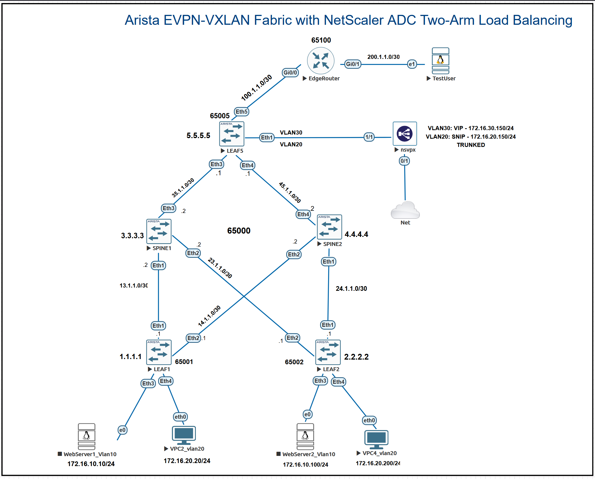

# Arista EVPN-VXLAN Fabric with NetScaler ADC Two-Arm Load Balancing



## Overview

This project extends a two-tier Arista EOS eBGP EVPN-VXLAN lab with a NetScaler ADC VPX application-delivery layer and external eBGP connectivity.

**PLEASE READ ME: Everything used to implement this lab is detailed below. Common constraints and recommended fixes are also highlighted.**

The proof of concept presents a controlled application-entry path:

```text
External test user
  -> EdgeRouter
  -> LEAF5 (border-service leaf)
  -> NetScaler ADC virtual IP (VIP) on VLAN 30
  -> NetScaler ADC subnet IP (SNIP) on VLAN 20
  -> EVPN-VXLAN IRB fabric
  -> WebServer1 or WebServer2 on VLAN 10
```

The NetScaler ADC terminates the client-side HTTP connection on the VIP, selects a healthy backend server from a service group, and opens a separate server-side connection sourced from the SNIP. The external test network can reach the application VIP but is deliberately not given direct reachability to the backend web-server subnet.

The result is an end-to-end demonstration of eBGP, EVPN-VXLAN, symmetric IRB, a border-service leaf, NetScaler ADC VPX, HTTP health monitoring, and round-robin application load balancing.

---

## Proof of Concept Objectives

This lab validates that:

- An external client can reach an HTTP application through an eBGP-connected edge router.
- LEAF5 operates as a **border-service leaf**: it connects the fabric to the external routing domain and attaches the NetScaler ADC.
- NetScaler exposes a client-facing VIP on VLAN 30 and uses a SNIP on VLAN 20 for server-side traffic.
- The NetScaler data interface is an 802.1Q trunk carrying VLANs 20 and 30. The deployment is therefore **logically two-arm** even though it uses one physical/vNIC data attachment.
- The EVPN-VXLAN fabric routes traffic from the SNIP in VLAN 20 to web servers in VLAN 10 through distributed IRB.
- HTTP health monitors identify healthy backend members.
- A load-balancing virtual server distributes separate HTTP requests between WebServer1 and WebServer2 using round robin.
- The external client cannot directly reach the backend subnet because the EdgeRouter has no route for VLAN 10.

---

## Architecture

### EVPN-VXLAN fabric

The data centre fabric consists of two spines and three leaf switches:

- **SPINE1** and **SPINE2** provide the underlay and EVPN peering layer.
- **LEAF1** and **LEAF2** attach workload endpoints.
- **LEAF5** is repurposed as a border-service leaf.

The fabric uses eBGP for both the IP underlay and EVPN control plane. Each leaf establishes EVPN sessions to the two spines using loopback addresses; the leaves do not form direct leaf-to-leaf EVPN sessions.

This avoids a leaf-to-leaf full mesh. With `N` leaves and `S` spines, the spine-mediated model uses approximately `N x S` EVPN sessions. For example, 1,500 leaves and two spines require 3,000 leaf-to-spine sessions, whereas a direct leaf-to-leaf full mesh would require 1,124,250 sessions.

The spine EVPN peer groups use `next-hop-unchanged`, preserving the originating leaf VTEP as the EVPN next hop.

### NetScaler ADC design

The ADC is configured as a full proxy:

```text
Client-side connection
TestUser -> VIP 172.16.30.150:80

Server-side connection
SNIP 172.16.20.150 -> WebServer1 or WebServer2:80
```

The **VIP** is the client-facing virtual IP address used by the load-balancing virtual server. The **SNIP** is the source address used by NetScaler when it communicates with backend servers and sends health-monitor probes.

The virtual server binds the VIP listener to a service group. The service group contains the backend server objects, protocol/port settings, and health-monitor state.

---

## Topology Roles

| Component | Role |
|---|---|
| SPINE1 / SPINE2 | eBGP underlay and EVPN peering layer |
| LEAF1 / LEAF2 | Workload leaves hosting the Ubuntu web servers |
| LEAF5 | Border-service leaf: external eBGP connection, ADC attachment, and VXLAN VTEP |
| EdgeRouter | Simulated external routing domain |
| TestUser | Simulated external HTTP client |
| NetScaler ADC VPX | Full-proxy load balancer with a frontend VIP and backend SNIP |
| WebServer1 / WebServer2 | Ubuntu Apache backend pool members |

---

## Software and Images

| Device / software | Version / image |
|---|---|
| Arista vEOS switches | EOS `4.29.2F` |
| EdgeRouter | Cisco IOSv `15.4` |
| NetScaler ADC VPX | `nsvpx-14.1-38.53` |
| Web servers | Ubuntu Server `20.04` |
| Lab platform | EVE-NG |

### Lab-only credentials

| System | Username | Password |
|---|---|---|
| Ubuntu lab image | `root` | `root` |
| NetScaler ADC VPX | `nsroot` | `cisco` |

> Change all default credentials in any environment that is not isolated and disposable.

---

## Addressing Plan

### Underlay and loopbacks

| Node | AS number | Loopback0 |
|---|---:|---|
| SPINE1 | 65000 | 3.3.3.3/32 |
| SPINE2 | 65000 | 4.4.4.4/32 |
| LEAF1 | 65001 | 1.1.1.1/32 |
| LEAF2 | 65002 | 2.2.2.2/32 |
| LEAF5 | 65005 | 5.5.5.5/32 |
| EdgeRouter | 65100 | N/A |

| Underlay link | Prefix |
|---|---|
| LEAF1 - SPINE1 | 13.1.1.0/30 |
| LEAF1 - SPINE2 | 14.1.1.0/30 |
| LEAF2 - SPINE1 | 23.1.1.0/30 |
| LEAF2 - SPINE2 | 24.1.1.0/30 |
| LEAF5 - SPINE1 | 35.1.1.0/30 |
| LEAF5 - SPINE2 | 45.1.1.0/30 |
| LEAF5 - EdgeRouter | 100.1.1.0/30 |
| EdgeRouter - TestUser | 200.1.1.0/30 |

### Overlay, application, and ADC addressing

| Network / object | Addressing | Purpose |
|---|---|---|
| VLAN 10 / VNI 10010 | 172.16.10.0/24 | Backend web-server subnet |
| VLAN 10 anycast gateway | 172.16.10.1 | Distributed IRB gateway |
| WebServer1 | 172.16.10.10/24 | Apache backend member |
| WebServer2 | 172.16.10.100/24 | Apache backend member |
| VLAN 20 / VNI 10020 | 172.16.20.0/24 | Routed ADC backend-side subnet |
| VLAN 20 anycast gateway | 172.16.20.1 | Distributed IRB gateway |
| NetScaler SNIP | 172.16.20.150/24 | NetScaler source address toward backends |
| VLAN 30 | 172.16.30.0/24 | Local frontend/DMZ VLAN on LEAF5 only |
| LEAF5 VLAN 30 SVI | 172.16.30.1/24 | Frontend gateway for the ADC and EdgeRouter path |
| NetScaler VIP | 172.16.30.150/24 | Client-facing HTTP virtual IP |
| TestUser | 200.1.1.1/30 | External HTTP client |
| EdgeRouter user-facing interface | 200.1.1.2/30 | TestUser default gateway |

The tenant VRF is `PROD`, with L3VNI `50000`. VLAN 30 is intentionally local to LEAF5 and is not stretched through the VXLAN overlay.

> The `100.1.1.0/30` and `200.1.1.0/30` prefixes are lab-only addressing in an isolated EVE-NG environment. Do not attach this design to a real Internet connection without using addresses assigned to you and applying appropriate security controls.

---

## Prerequisite: Arista EOS Initialisation

Some vEOS images boot with Zero Touch Provisioning enabled and/or use a routing-protocol model other than multi-agent, and has lab host’s resource limits and how QEMU/EVE-NG emulates interfaces..

If required, complete the following on **every Arista switch** before applying the lab configuration.

### 1. Limit vEOS Interfaces

Configure only the virtual interfaces required by the lab, plus one spare where useful. Reducing unused vNICs lowers QEMU/EVE-NG overhead and can improve boot stability on hosts with limited CPU and RAM.

| Device | vNICs to Configure | Suggested Use |
|---|---:|---|
| Leaf1, Leaf2, Leaf5 | 5 | 4 Ethernet data ports + 1 management port |
| Spine1, Spine2 | 4 | 3 Ethernet data ports + 1 management port |

These limits are lab-sizing recommendations, not EOS feature requirements. Add more vNICs only when the topology needs them.

### 2. Disable Zero Touch Provisioning

On a newly deployed vEOS node, disable Zero Touch Provisioning if it is enabled:

```text
enable
zerotouch cancel
reload
```

### 3. Enable multi-agent routing protocol mode

After the first reboot:

```text
enable
configure terminal
service routing protocols model multi-agent
end
write memory
reload
```
**Note**
Each affected switch may therefore reboot twice:

After cancelling Zero Touch Provisioning.
After enabling multi-agent routing protocol mode.

If Zero Touch Provisioning is already disabled and the EOS image is already using multi-agent mode, these steps are not required.

The vNIC limitation is separate from the Zero Touch Provisioning and multi-agent steps. Limit vNICs only when needed to keep the EVE-NG lab within the available CPU and RAM resources.

---

## EVE-NG Connections

| Connection | Purpose |
|---|---|
| LEAF1 Ethernet3 -> WebServer1 | VLAN 10 backend member |
| LEAF2 Ethernet3 -> WebServer2 | VLAN 10 backend member |
| LEAF1 / LEAF2 Ethernet4 -> VPC endpoints | Existing VLAN 20 endpoints |
| LEAF5 Ethernet1 -> NetScaler 1/1 | 802.1Q trunk carrying VLANs 20 and 30 |
| LEAF5 Ethernet5 -> EdgeRouter Gi0/0 | eBGP external-routing attachment |
| EdgeRouter Gi0/1 -> TestUser | External client segment |
| NetScaler 0/1 -> EVE-NG management cloud | NSIP, browser GUI, SSH/API management |

### LEAF5 trunk

The NetScaler data path is carried on one trunk. Example LEAF5 configuration:

```text
interface Ethernet1
   switchport mode trunk
   switchport trunk allowed vlan 20,30
```

This remains a **two-arm design logically**:

- VLAN 30 is the frontend/client side carrying the VIP.
- VLAN 20 is the backend-side subnet carrying the SNIP.

The physical interface is shared, but the client and backend traffic remain separated by VLAN and NetScaler IP/VLAN bindings.

---

## Arista EVPN-VXLAN Configuration Notes

The original fabric configuration provides:

```text
VLAN 10 -> VNI 10010
VLAN 20 -> VNI 10020
VRF PROD -> L3VNI 50000
VXLAN UDP destination port -> 4789
```

The workload leaves use distributed anycast gateway addresses:

```text
VLAN 10 gateway -> 172.16.10.1/24
VLAN 20 gateway -> 172.16.20.1/24
```

For the external proof of concept:

- LEAF5 and EdgeRouter use eBGP across `100.1.1.0/30`.
- EdgeRouter advertises `200.1.1.0/30` toward LEAF5.
- LEAF5 advertises the frontend VIP subnet, `172.16.30.0/24`, toward EdgeRouter.
- The LEAF5 intentionally does **not** advertise `172.16.10.0/24` route to the EdgeRouter.

This keeps the backend subnet hidden from the external client while allowing NetScaler to proxy application traffic into the fabric.

---

## Ubuntu Web Servers

### 1. Configure persistent networking

The web-server IP addresses must be configured on the Ubuntu **data-facing NICs**, not in Apache itself. Apache listens on the host IP address once the service is running.

The exact interface names may differ. Identify them first:

```bash
ip a
```

Edit the existing Netplan file. In this lab, the file is:

```bash
sudo nano /etc/netplan/01-netcfg.yaml
```

Example for **WebServer1**. Replace `ens3` and `ens4` with the interface names used by your VM.

```yaml
network:
  version: 2
  ethernets:
    ens3:
      dhcp4: true
    ens4:
      dhcp4: false
      addresses:
        - 172.16.10.10/24
      routes:
        - to: 172.16.20.0/24
          via: 172.16.10.1
```

For **WebServer2**, use:

```yaml
        - 172.16.10.100/24
```

Apply the configuration:

```bash
sudo netplan apply
ip a
ip route
```

### Default-gateway and return-path note

A return path is mandatory.

- If the data interface owns the default route, use `172.16.10.1` as the default gateway.
- If a separate management NIC obtains the default route through DHCP, retain that management default route and add the specific route to `172.16.20.0/24` through `172.16.10.1`, as shown above.

The specific route is required because the SNIP now resides in VLAN 20 while the servers reside in VLAN 10.

### 2. Install and enable Apache

On WebServer1:

```bash
sudo apt update
sudo apt install -y apache2
printf 'WEB01\n' | sudo tee /var/www/html/index.html
sudo systemctl enable --now apache2
curl http://172.16.10.10
```

On WebServer2:

```bash
sudo apt update
sudo apt install -y apache2
printf 'WEB02\n' | sudo tee /var/www/html/index.html
sudo systemctl enable --now apache2
curl http://172.16.10.100
```

The distinct page content makes it easy to confirm which backend answered each request.

---

## NetScaler ADC VPX Configuration

> The NetScaler configuration export is intentionally not included in this public repository. VPX backups and configuration files can contain licensing, management, and environment-specific information. Recreate the following objects manually in your own isolated lab.

### 1. Management access

Connect NetScaler interface `0/1` to the EVE-NG management cloud and configure an NSIP reachable from your workstation.

Open the management interface in a browser:

```text
https://<NSIP>
```

Default lab login:

```text
Username: nsroot
Password: nsroot (if you haven't changed it yet. I used "cisco")
```

### 2. Create the SNIP

Navigate to:

```text
System -> Network -> IPs -> IPv4s -> Add
```

Create:

| Field | Value |
|---|---|
| IP address | 172.16.20.150 |
| Netmask | 255.255.255.0 |
| Type | Subnet IP |

### 3. Create the VIP

Navigate to:

```text
System -> Network -> IPs -> IPv4s -> Add
```

Create:

| Field | Value |
|---|---|
| IP address | 172.16.30.150 |
| Netmask | 255.255.255.0 |
| Type | Virtual IP |

The VIP is the frontend address on which the load-balancing virtual server listens. It is not a backend server address.

### 4. Create VLAN bindings

Navigate to:

```text
System -> Network -> VLANs
```

Create the following VLANs. Use the same NetScaler data interface, `1/1`, as a **tagged** member of both VLANs.

| VLAN | Interface binding | IP binding | Purpose |
|---|---|---|---|
| VLAN 20 | `1/1` tagged | SNIP `172.16.20.150` | Backend-side routed subnet |
| VLAN 30 | `1/1` tagged | VIP `172.16.30.150` | Frontend/client subnet |

Do not enable dynamic routing on NetScaler for this proof of concept.

### 5. Add static routes

Navigate to:

```text
System -> Network -> Routes -> Add
```

Create these routes:

| Destination | Mask | Next hop | Reason |
|---|---|---|---|
| 172.16.10.0 | 255.255.255.0 | 172.16.20.1 | Reach the backend web-server subnet via IRB |
| 200.1.1.0 | 255.255.255.252 | 172.16.30.1 | Return traffic to the external test user |

An optional default route is:

```text
0.0.0.0/0 via 172.16.30.1
```

If you configure a default route in the GUI, use:

```text
Network: 0.0.0.0
Netmask: 0.0.0.0
Gateway: 172.16.30.1
```

Keeping the specific `200.1.1.0/30` route is useful when the management interface has its own default route.

### 6. Create backend server objects

Navigate to:

```text
Traffic Management -> Load Balancing -> Servers -> Add
```

Create:

| Name | IP address |
|---|---|
| WEB01 | 172.16.10.10 |
| WEB02 | 172.16.10.100 |

### 7. Create the service group

Navigate to:

```text
Traffic Management -> Load Balancing -> Service Groups -> Add
```

Use:

| Field | Value |
|---|---|
| Name | WEB_HTTP_SG |
| Protocol | HTTP |
| Health monitoring | Enabled |

Add these members:

| Member | Port |
|---|---:|
| WEB01 | 80 |
| WEB02 | 80 |

The service group should display **UP** only after the NetScaler can reach both Apache servers and receive successful HTTP-monitor responses.

### 8. Create the load-balancing virtual server

Navigate to:

```text
Traffic Management -> Load Balancing -> Virtual Servers -> Add
```

Use:

| Field | Value |
|---|---|
| Name | WEB_VIP_HTTP |
| Protocol | HTTP |
| IP address | 172.16.30.150 |
| Port | 80 |
| Load-balancing method | Round Robin |

Under **Services and Service Groups**, bind `WEB_HTTP_SG` to the virtual server.

> In the GUI, complete the binding workflow and click **Done**. Adding a service group in a pop-up does not finish the virtual-server configuration until the page is committed.

Finally, save the running configuration using the GUI save option or:

```text
save ns config
```

---

## TestUser Configuration

The TestUser represents an external user. It uses the EdgeRouter as its default gateway:

```text
TestUser IP address: 200.1.1.1/30
Default gateway:    200.1.1.2
```

Install curl if required:

```bash
sudo apt update
sudo apt install -y curl
```

---

## Validation

### 1. Confirm ADC health

In NetScaler GUI, confirm:

```text
WEB_HTTP_SG  -> UP
WEB_VIP_HTTP -> UP
```

A service group or virtual server being UP confirms backend health and successful object binding. It does not by itself prove that an outside client has a valid return path.

### 2. Validate end-to-end load balancing

From TestUser:

```bash
curl http://172.16.30.150
```

Run multiple independent requests:

```bash
for i in {1..8}; do
  curl -s http://172.16.30.150
  echo
done
```

Expected result:

```text
WEB01
WEB02
WEB01
WEB02
```

The alternating responses prove that:

1. TestUser reaches the EdgeRouter.
2. EdgeRouter reaches LEAF5.
3. LEAF5 forwards frontend traffic on VLAN 30 to the VIP.
4. NetScaler accepts the HTTP request on the VIP.
5. NetScaler selects healthy backend members through `WEB_HTTP_SG`.
6. NetScaler sources the server-side connection from SNIP `172.16.20.150`.
7. EVPN-VXLAN IRB routes traffic from VLAN 20 to the VLAN 10 web servers.
8. The return path from NetScaler reaches the external test user.

### 3. Validate backend isolation

From TestUser, direct backend reachability should fail because the EdgeRouter has no route to VLAN 10:

```bash
ping 172.16.10.1
```

The exact message may be `Destination Host Unreachable` from the EdgeRouter.

This demonstrates the intended behaviour: the external network sees the VIP, not the backend network.

### 4. Optional failure test

Stop Apache on one backend server:

```bash
sudo systemctl stop apache2
```

Expected result:

- The affected member becomes DOWN.
- The service group becomes PARTIAL UP.
- Requests continue through the remaining healthy server.

Restore it with:

```bash
sudo systemctl start apache2
```

---

## Troubleshooting Notes

| Symptom | Likely check |
|---|---|
| Service group is DOWN | Verify Apache is running, server IPs are correct, SNIP route to VLAN 10 exists, and web-server return route to VLAN 20 exists. |
| Service group is UP but `curl` to VIP times out | Check the NetScaler route to `200.1.1.0/30` through `172.16.30.1`, EdgeRouter route to VLAN 30, and trunk VLAN 30 tagging. |
| TestUser can ping 172.16.30.1 but cannot curl the VIP | Check that `WEB_VIP_HTTP` is UP, port 80 is configured, the service group is bound, and the NetScaler return route is correct. |
| VIP does not answer ICMP | This does not necessarily indicate an HTTP failure. Validate with `curl` and virtual-server statistics. |
| Configuration disappears after a reboot | Save NetScaler with `save ns config`; make Ubuntu network configuration persistent in Netplan. |
| Default route does not work | Verify that it is `0.0.0.0/0`, not `0.0.0.0/32`. |

---

## Future Enhancements

- Add a firewall or NGFW between the EdgeRouter and frontend VLAN.
- Add HTTPS, certificates, TLS termination, and HTTP-to-HTTPS redirect.
- Add persistence and content switching policies.
- Deploy a NetScaler HA pair.
- Add WAF policy testing.
- Add a second site and GSLB.
- Automate Arista and NetScaler configuration through Ansible, Jinja2, and API-driven workflows.
- Separate automation concerns into underlay, EVPN-VXLAN, border-service, and ADC roles.

---

## Outcome

This project demonstrates that a NetScaler ADC can be integrated cleanly into a modern eBGP EVPN-VXLAN fabric without exposing backend workloads directly to the external routing domain. It also provides a practical foundation for additional ADC capabilities such as TLS offload, WAF, HA, GSLB, and automation.

## 📧 Contact

- **Author**: Patrick Ukponu
- Network Engineer
- **LinkedIn**: https://www.linkedin.com/in/patrick-u-78a001176/
- **Email**: pat.ukponu@gmail.com